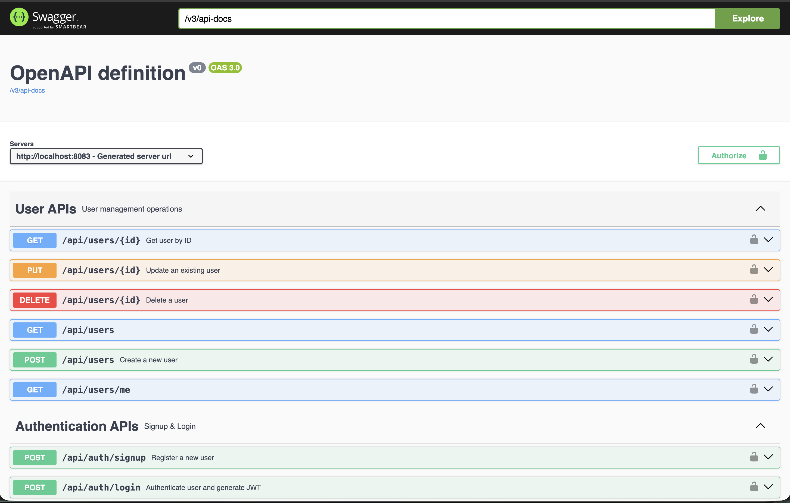
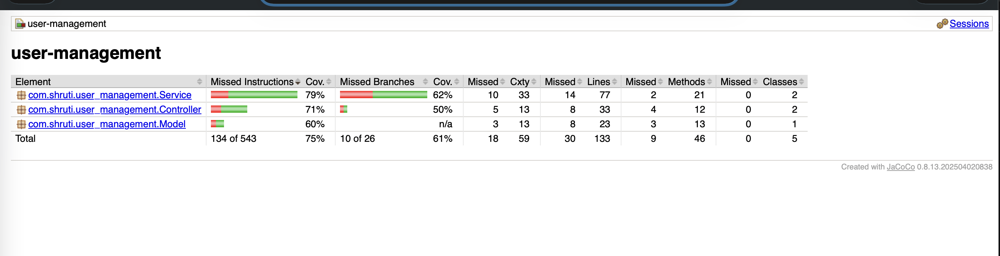

# User Management System - Spring Boot

User Management REST API built using Spring Boot with JWT authentication, secure CRUD APIs, testing, code coverage, Swagger documentation, and CI using GitHub Actions.

This project demonstrates real-world backend engineering practices and production-ready setup.

--------------------------------------------------

PROJECT FEATURES

- User registration and authentication using JWT
- Secure REST APIs using Spring Security
- CRUD operations for users
- Global exception handling
- Request validation using Jakarta Validation
- Swagger / OpenAPI documentation
- Unit testing and integration testing
- Code coverage using JaCoCo
- CI pipeline using GitHub Actions

--------------------------------------------------

TECH STACK

- Java 17
- Spring Boot
- Spring Security + JWT
- Spring Data JPA
- H2 In-Memory Database
- Gradle
- Swagger (springdoc-openapi)
- JUnit 5 and Mockito
- JaCoCo
- GitHub Actions

--------------------------------------------------

PROJECT STRUCTURE

src
 ├── main
 │   ├── java/com/shruti/user_management
 │   │   ├── Controller
 │   │   ├── Service
 │   │   ├── Repository
 │   │   ├── Security
 │   │   ├── DTO
 │   │   └── Exception
 │   └── resources
 └── test
     ├── Service
     └── Controller

--------------------------------------------------

AUTHENTICATION FLOW (JWT)

1. User registers using signup API
2. User logs in using login API
3. JWT token is generated and returned
4. Token is sent in request headers for secured APIs

Authorization header format:
Authorization: Bearer <JWT_TOKEN>

--------------------------------------------------

API ENDPOINTS

Auth APIs

POST /api/auth/signup  
POST /api/auth/login  

User APIs

GET /api/users  
GET /api/users/{id}  
POST /api/users  
PUT /api/users/{id}  
DELETE /api/users/{id}  
GET /api/users/me  

--------------------------------------------------

SWAGGER DOCUMENTATION

Swagger UI is available at:
http://localhost:8080/swagger-ui.html

Swagger provides:
- API endpoint documentation
- Request and response schemas
- JWT Authorization support

--------------------------------------------------

RUNNING THE APPLICATION

To run the application locally:
./gradlew bootRun

Application will start on:
http://localhost:8080

--------------------------------------------------

TESTING

Unit tests and integration tests are implemented.

To run tests:
./gradlew test

--------------------------------------------------

CODE COVERAGE (JACOCO)

Generate JaCoCo coverage report:
./gradlew clean test jacocoTestReport

View the HTML report:
build/reports/jacoco/test/html/index.html

Coverage enforcement:
./gradlew jacocoTestCoverageVerification

--------------------------------------------------

CI/CD USING GITHUB ACTIONS

This project includes a CI pipeline using GitHub Actions.

On every push:
- Code is checked out
- Java is set up
- Tests are executed
- Build fails on test or coverage failure

Workflow file location:
.github/workflows/ci.yml

--------------------------------------------------

Screenshots

Swagger API Documentation

JaCoCo Test Coverage Report

--------------------------------------------------

AUTHOR

Shruti Jena  
Backend Developer - Java, Spring Boot

